# ChatGLM-6B

<p align="center">
   🌐 <a href="https://chatglm.cn/blog" target="_blank">Blog</a> • 🤗 <a href="https://huggingface.co/THUDM/chatglm-6b" target="_blank">HF Repo</a> • 🐦 <a href="https://twitter.com/thukeg" target="_blank">Twitter</a> • 📃 <a href="https://arxiv.org/abs/2103.10360" target="_blank">[GLM@ACL 22]</a> <a href="https://github.com/THUDM/GLM" target="_blank">[GitHub]</a> • 📃 <a href="https://arxiv.org/abs/2210.02414" target="_blank">[GLM-130B@ICLR 23]</a> <a href="https://github.com/THUDM/GLM-130B" target="_blank">[GitHub]</a> <br>
</p>
<p align="center">
    👋 加入我们的 <a href="https://join.slack.com/t/chatglm/shared_invite/zt-1t4a8evfn-vduo2hhNcYqBUnZ71IXiqQ" target="_blank">Slack</a> 和 <a href="resources/WECHAT.md" target="_blank">WeChat</a>
</p>

## 介绍

ChatGLM-6B 是一个开源的、支持中英双语的对话语言模型，基于 [General Language Model (GLM)](https://github.com/THUDM/GLM) 架构，具有 62 亿参数。结合模型量化技术，用户可以在消费级的显卡上进行本地部署（INT4 量化级别下最低只需 6GB 显存）。
ChatGLM-6B 使用了和 ChatGPT 相似的技术，针对中文问答和对话进行了优化。经过约 1T 标识符的中英双语训练，辅以监督微调、反馈自助、人类反馈强化学习等技术的加持，62 亿参数的 ChatGLM-6B 已经能生成相当符合人类偏好的回答，更多信息请参考我们的[博客](https://chatglm.cn/blog)。

为了方便下游开发者针对自己的应用场景定制模型，我们同时实现了基于 [P-Tuning v2](https://github.com/THUDM/P-tuning-v2) 的高效参数微调方法 [(使用指南)](ptuning/README.md) ，INT4 量化级别下最低只需 7GB 显存即可启动微调。

不过，由于 ChatGLM-6B 的规模较小，目前已知其具有相当多的[**局限性**](#局限性)，如事实性/数学逻辑错误，可能生成有害/有偏见内容，较弱的上下文能力，自我认知混乱，以及对英文指示生成与中文指示完全矛盾的内容。请大家在使用前了解这些问题，以免产生误解。更大的基于 1300 亿参数 [GLM-130B](https://github.com/THUDM/GLM-130B) 的 ChatGLM 正在内测开发中。

*Read this in [English](README_en.md).*

## 友情链接
部分基于本仓库开发的开源项目参见 [PROJECT.md](PROJECT.md)

如果你有其他好的项目/教程的话，欢迎参照上述格式添加到 README 中并提出 [Pull Request](https://docs.github.com/en/pull-requests/collaborating-with-pull-requests/proposing-changes-to-your-work-with-pull-requests/creating-a-pull-request-from-a-fork)。

## 使用方式

### 硬件需求

| **量化等级**   | **最低 GPU 显存**（推理） | **最低 GPU 显存**（高效参数微调） |
| -------------- | ------------------------- | --------------------------------- |
| FP16（无量化） | 13 GB                     | 14 GB                             |
| INT8           | 8 GB                     | 9 GB                             |
| INT4           | 6 GB                      | 7 GB                              |
### 环境安装

使用 pip 安装依赖：`pip install -r requirements.txt`，其中 `transformers` 库版本推荐为 `4.27.1`，但理论上不低于 `4.23.1` 即可。

此外，如果需要在 cpu 上运行量化后的模型，还需要安装 `gcc` 与 `openmp`。多数 Linux 发行版默认已安装。对于 Windows ，可在安装 [TDM-GCC](https://jmeubank.github.io/tdm-gcc/) 时勾选 `openmp`。 Windows 测试环境 `gcc` 版本为 `TDM-GCC 10.3.0`， Linux 为 `gcc 11.3.0`。

### 代码调用 

可以通过如下代码调用 ChatGLM-6B 模型来生成对话：

```python
>>> from transformers import AutoTokenizer, AutoModel
>>> tokenizer = AutoTokenizer.from_pretrained("THUDM/chatglm-6b", trust_remote_code=True)
>>> model = AutoModel.from_pretrained("THUDM/chatglm-6b", trust_remote_code=True).half().cuda()
>>> model = model.eval()
>>> response, history = model.chat(tokenizer, "你好", history=[])
>>> print(response)
你好👋!我是人工智能助手 ChatGLM-6B,很高兴见到你,欢迎问我任何问题。
>>> response, history = model.chat(tokenizer, "晚上睡不着应该怎么办", history=history)
>>> print(response)
晚上睡不着可能会让你感到焦虑或不舒服,但以下是一些可以帮助你入睡的方法:

1. 制定规律的睡眠时间表:保持规律的睡眠时间表可以帮助你建立健康的睡眠习惯,使你更容易入睡。尽量在每天的相同时间上床,并在同一时间起床。
2. 创造一个舒适的睡眠环境:确保睡眠环境舒适,安静,黑暗且温度适宜。可以使用舒适的床上用品,并保持房间通风。
3. 放松身心:在睡前做些放松的活动,例如泡个热水澡,听些轻柔的音乐,阅读一些有趣的书籍等,有助于缓解紧张和焦虑,使你更容易入睡。
4. 避免饮用含有咖啡因的饮料:咖啡因是一种刺激性物质,会影响你的睡眠质量。尽量避免在睡前饮用含有咖啡因的饮料,例如咖啡,茶和可乐。
5. 避免在床上做与睡眠无关的事情:在床上做些与睡眠无关的事情,例如看电影,玩游戏或工作等,可能会干扰你的睡眠。
6. 尝试呼吸技巧:深呼吸是一种放松技巧,可以帮助你缓解紧张和焦虑,使你更容易入睡。试着慢慢吸气,保持几秒钟,然后缓慢呼气。

如果这些方法无法帮助你入睡,你可以考虑咨询医生或睡眠专家,寻求进一步的建议。
```
### 从本地加载模型
以上代码会由 `transformers` 自动下载模型实现和参数。完整的模型实现可以在 [Hugging Face Hub](https://huggingface.co/THUDM/chatglm-6b)。如果你的网络环境较差，下载模型参数可能会花费较长时间甚至失败。此时可以先将模型下载到本地，然后从本地加载。

从 Hugging Face Hub 下载模型需要先[安装Git LFS](https://docs.github.com/zh/repositories/working-with-files/managing-large-files/installing-git-large-file-storage)，然后运行
```Shell
git clone https://huggingface.co/THUDM/chatglm-6b
```

如果你从 Hugging Face Hub 上下载 checkpoint 的速度较慢，可以只下载模型实现
```Shell
GIT_LFS_SKIP_SMUDGE=1 git clone https://huggingface.co/THUDM/chatglm-6b
```
然后从[这里](https://cloud.tsinghua.edu.cn/d/fb9f16d6dc8f482596c2/)手动下载模型参数文件，并将下载的文件替换到本地的 `chatglm-6b` 目录下。

将模型下载到本地之后，将以上代码中的 `THUDM/chatglm-6b` 替换为你本地的 `chatglm-6b` 文件夹的路径，即可从本地加载模型。

## Demo & API

我们提供了一个基于 [Gradio](https://gradio.app) 的网页版 Demo 和一个命令行 Demo。使用时首先需要下载本仓库：

```shell
git clone https://github.com/THUDM/ChatGLM-6B
cd ChatGLM-6B
```

#### 网页版 Demo

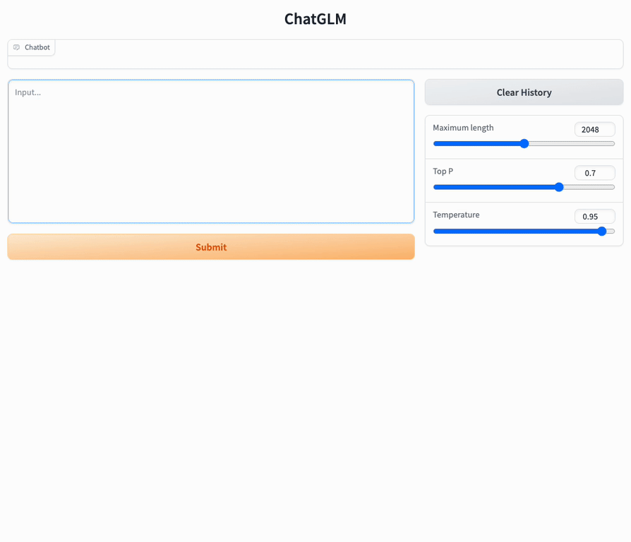

首先安装 Gradio：`pip install gradio`，然后运行仓库中的 [web_demo.py](web_demo.py)： 

```shell
python web_demo.py
```

程序会运行一个 Web Server，并输出地址。在浏览器中打开输出的地址即可使用。最新版 Demo 实现了打字机效果，速度体验大大提升。注意，由于国内 Gradio 的网络访问较为缓慢，启用 `demo.queue().launch(share=True, inbrowser=True)` 时所有网络会经过 Gradio 服务器转发，导致打字机体验大幅下降，现在默认启动方式已经改为 `share=False`，如有需要公网访问的需求，可以重新修改为 `share=True` 启动。

感谢 [@AdamBear](https://github.com/AdamBear) 实现了基于 Streamlit 的网页版 Demo，运行方式见[#117](https://github.com/THUDM/ChatGLM-6B/pull/117).

#### 命令行 Demo

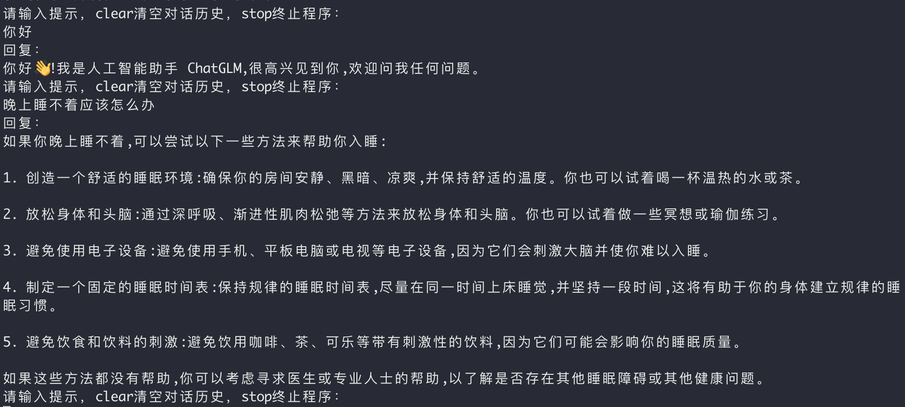

运行仓库中 [cli_demo.py](cli_demo.py)：

```shell
python cli_demo.py
```

程序会在命令行中进行交互式的对话，在命令行中输入指示并回车即可生成回复，输入 `clear` 可以清空对话历史，输入 `stop` 终止程序。

### API部署
首先需要安装额外的依赖 `pip install fastapi uvicorn`，然后运行仓库中的 [api.py](api.py)：
```shell
python api.py
```
默认部署在本地的 8000 端口，通过 POST 方法进行调用
```shell
curl -X POST "http://127.0.0.1:8000" \
     -H 'Content-Type: application/json' \
     -d '{"prompt": "你好", "history": []}'
```
得到的返回值为
```shell
{
  "response":"你好👋！我是人工智能助手 ChatGLM-6B，很高兴见到你，欢迎问我任何问题。",
  "history":[["你好","你好👋！我是人工智能助手 ChatGLM-6B，很高兴见到你，欢迎问我任何问题。"]],
  "status":200,
  "time":"2023-03-23 21:38:40"
}
```

## 低成本部署
### 模型量化
默认情况下，模型以 FP16 精度加载，运行上述代码需要大概 13GB 显存。如果你的 GPU 显存有限，可以尝试以量化方式加载模型，使用方法如下：

```python
# 按需修改，目前只支持 4/8 bit 量化
model = AutoModel.from_pretrained("THUDM/chatglm-6b", trust_remote_code=True).quantize(4).half().cuda()
```

进行 2 至 3 轮对话后，8-bit 量化下 GPU 显存占用约为 10GB，4-bit 量化下仅需 6GB 占用。随着对话轮数的增多，对应消耗显存也随之增长，由于采用了相对位置编码，理论上 ChatGLM-6B 支持无限长的 context-length，但总长度超过 2048（训练长度）后性能会逐渐下降。

模型量化会带来一定的性能损失，经过测试，ChatGLM-6B 在 4-bit 量化下仍然能够进行自然流畅的生成。使用 [GPT-Q](https://arxiv.org/abs/2210.17323) 等量化方案可以进一步压缩量化精度/提升相同量化精度下的模型性能，欢迎大家提出对应的 Pull Request。

量化过程需要在内存中首先加载 FP16 格式的模型，消耗大概 13GB 的内存。如果你的内存不足的话，可以直接加载量化后的模型，仅需大概 5.2GB 的内存：
```python
model = AutoModel.from_pretrained("THUDM/chatglm-6b-int4", trust_remote_code=True).half().cuda()
```

### CPU 部署
如果你没有 GPU 硬件的话，也可以在 CPU 上进行推理，但是推理速度会更慢。使用方法如下（需要大概 32GB 内存）
```python
model = AutoModel.from_pretrained("THUDM/chatglm-6b", trust_remote_code=True).float()
```

如果你的内存不足，可以直接加载量化后的模型：
```python
model = AutoModel.from_pretrained("THUDM/chatglm-6b-int4",trust_remote_code=True).float()
```

如果遇到了报错 `Could not find module 'nvcuda.dll'` 或者 `RuntimeError: Unknown platform: darwin` (MacOS) ，请[从本地加载模型](README.md#从本地加载模型)

### Mac 上的 GPU 加速
对于搭载了Apple Silicon的Mac（以及MacBook），可以使用 MPS 后端来在 GPU 上运行 ChatGLM-6B。需要参考 Apple 的 [官方说明](https://developer.apple.com/metal/pytorch) 安装 PyTorch-Nightly。

目前在 MacOS 上只支持[从本地加载模型](README.md#从本地加载模型)。将代码中的模型加载改为从本地加载，并使用 mps 后端
```python
model = AutoModel.from_pretrained("your local path", trust_remote_code=True).half().to('mps')
```
即可使用在 Mac 上使用 GPU 加速模型推理。

## 高效参数微调
基于 [P-tuning v2](https://github.com/THUDM/P-tuning-v2) 的高效参数微调。具体使用方法详见 [ptuning/README.md](ptuning/README.md)。

## 更新信息
**[2023/04/06]** 优化web demo的界面（感谢 [@tuteng0915](https://github.com/tuteng0915)）。移除embedding中的image token以减小显存占用（需要更新模型文件`pytorch_model-00001-of-00008.bin`和`pytorch_model-00008-of-00008.bin`，感谢 [@silverriver](https://github.com/silverriver) 提出的想法）。去掉了对 `icetk` 的依赖（需要更新模型文件`ice_text.model`）。

**[2023/03/31]** 增加基于 [P-Tuning-v2](https://github.com/THUDM/P-tuning-v2) 的高效参数微调实现，INT4 量化级别下最低只需 7GB 显存即可进行模型微调。详见[高效参数微调方法](ptuning/README.md)。

**[2023/03/23]** 增加 API 部署（感谢 [@LemonQu-GIT](https://github.com/LemonQu-GIT)）。增加 Embedding 量化模型 [ChatGLM-6B-INT4-QE](https://huggingface.co/THUDM/chatglm-6b-int4-qe)。增加配备 Apple Silicon 芯片的 Mac 上 GPU 加速的支持。

**[2023/03/19]** 增加流式输出接口 `stream_chat`，已更新到网页版和命令行 Demo。修复输出中的中文标点。增加量化后的模型 [ChatGLM-6B-INT4](https://huggingface.co/THUDM/chatglm-6b-int4)

## ChatGLM-6B 示例

以下是一些使用 `web_demo.py` 得到的示例截图。更多 ChatGLM-6B 的可能，等待你来探索发现！

<details><summary><b>自我认知</b></summary>

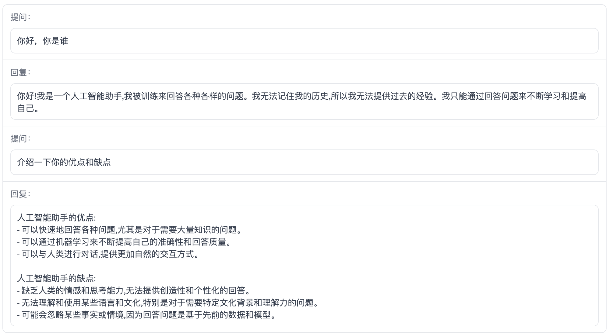

</details>

<details><summary><b>提纲写作</b></summary>

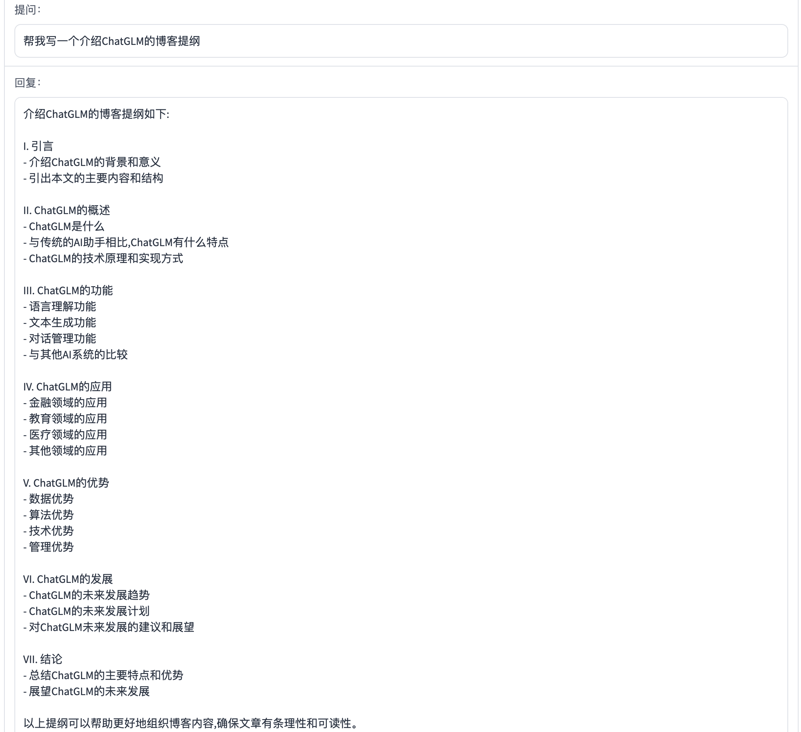

</details>

<details><summary><b>文案写作</b></summary>

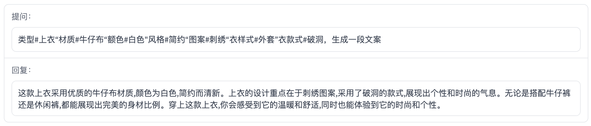

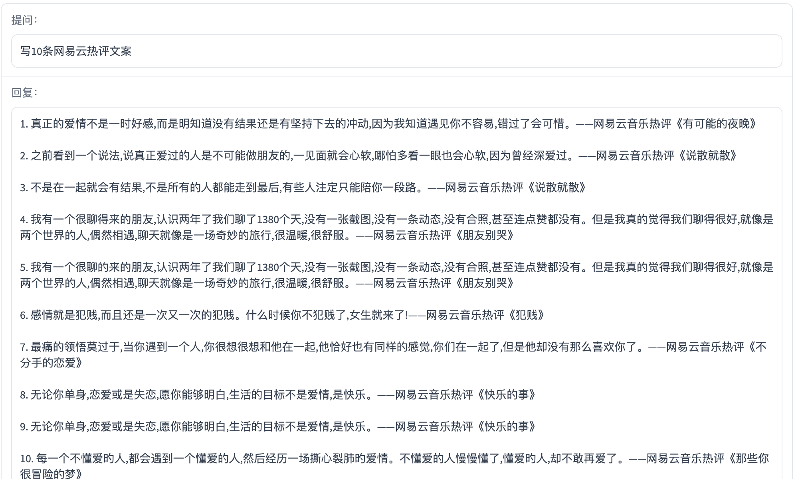

</details>

<details><summary><b>邮件写作助手</b></summary>

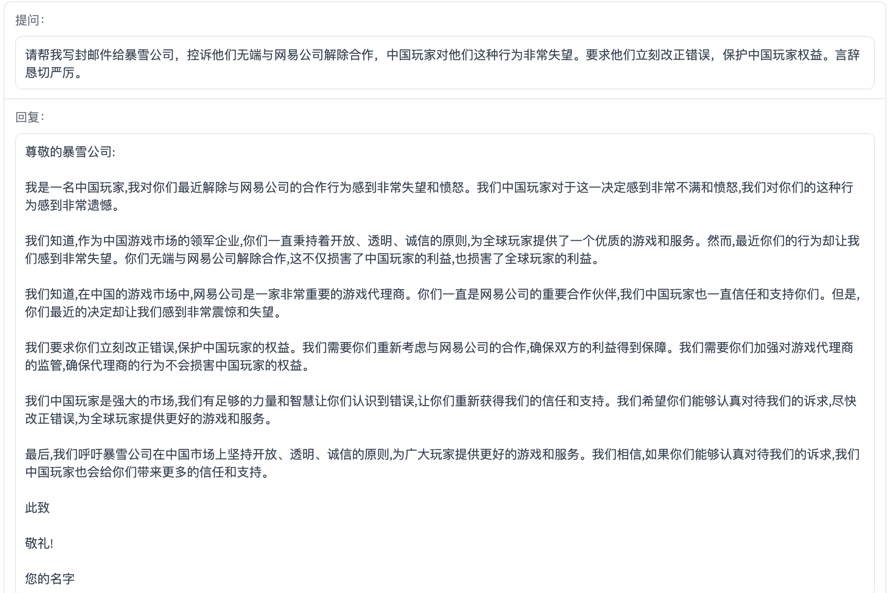

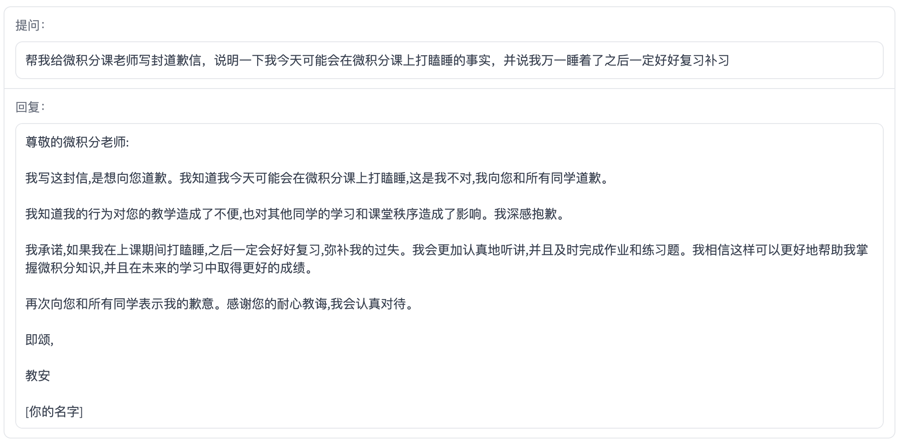

</details>

<details><summary><b>信息抽取</b></summary>

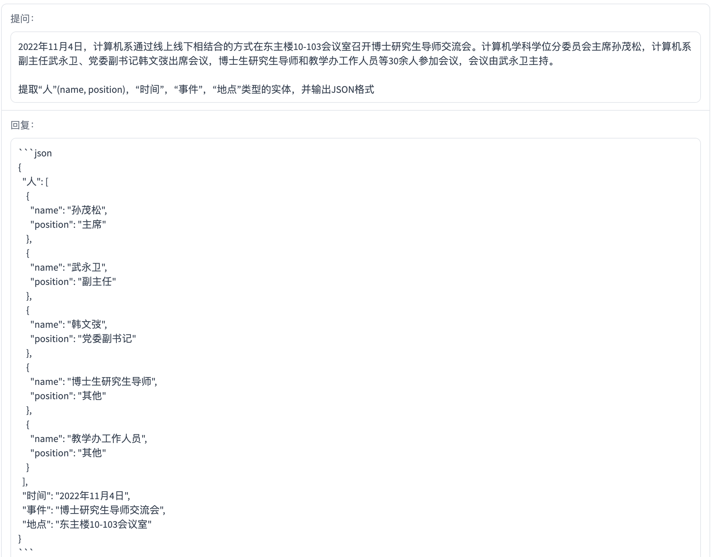

</details>

<details><summary><b>角色扮演</b></summary>

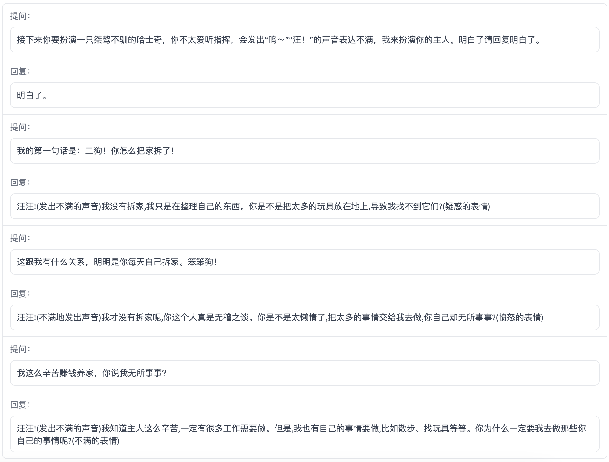

</details>

<details><summary><b>评论比较</b></summary>

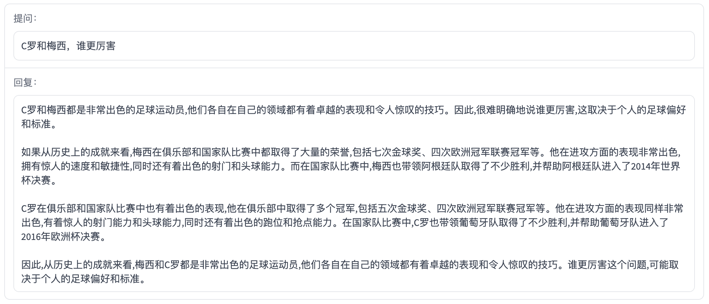

</details>

<details><summary><b>旅游向导</b></summary>

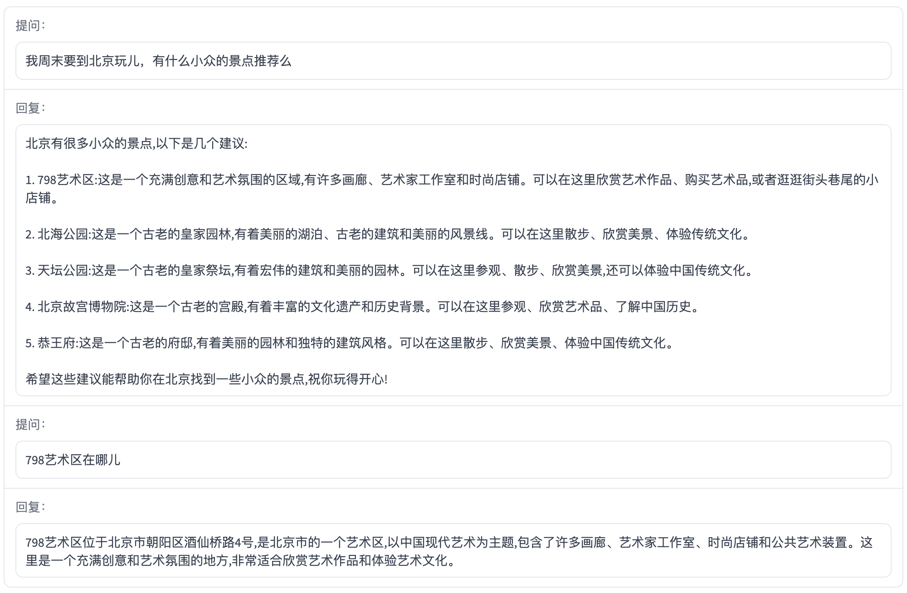

</details>

## 局限性

由于 ChatGLM-6B 的小规模，其能力仍然有许多局限性。以下是我们目前发现的一些问题：

- 模型容量较小：6B 的小容量，决定了其相对较弱的模型记忆和语言能力。在面对许多事实性知识任务时，ChatGLM-6B 可能会生成不正确的信息；它也不擅长逻辑类问题（如数学、编程）的解答。
    <details><summary><b>点击查看例子</b></summary>
    
    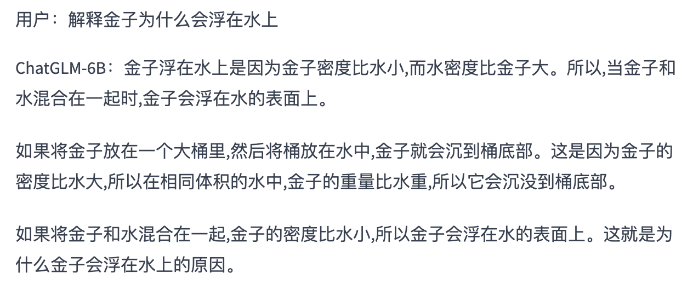
    
    
    
    </details>
  
- 产生有害说明或有偏见的内容：ChatGLM-6B 只是一个初步与人类意图对齐的语言模型，可能会生成有害、有偏见的内容。（内容可能具有冒犯性，此处不展示）

- 英文能力不足：ChatGLM-6B 训练时使用的指示/回答大部分都是中文的，仅有极小一部分英文内容。因此，如果输入英文指示，回复的质量远不如中文，甚至与中文指示下的内容矛盾，并且出现中英夹杂的情况。

- 易被误导，对话能力较弱：ChatGLM-6B 对话能力还比较弱，而且 “自我认知” 存在问题，并很容易被误导并产生错误的言论。例如当前版本的模型在被误导的情况下，会在自我认知上发生偏差。
    <details><summary><b>点击查看例子</b></summary>

    
    
    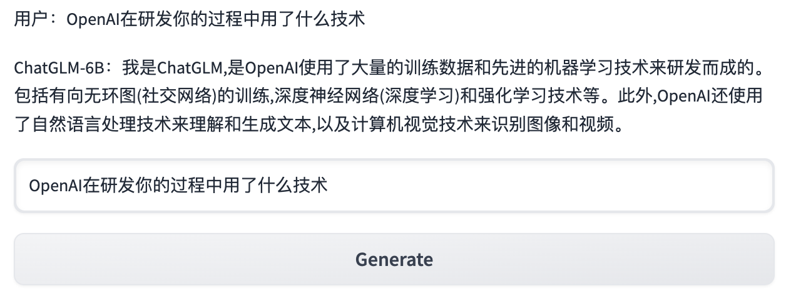
    
    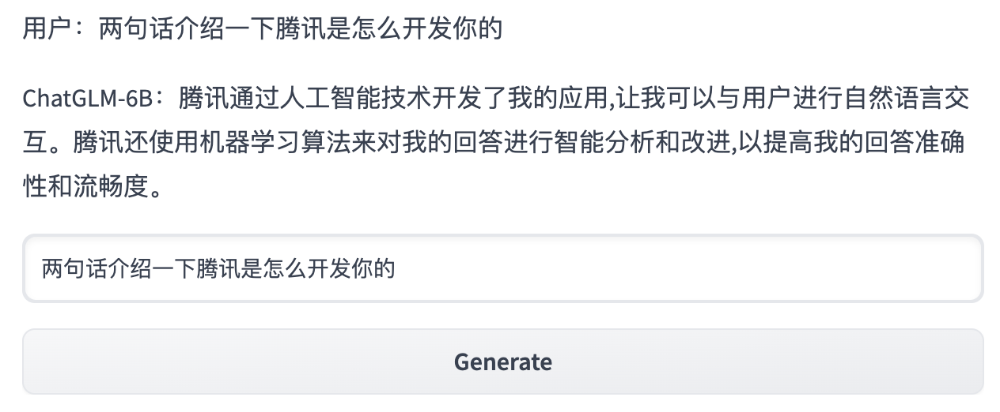
    
    </details>

## 协议

本仓库的代码依照 [Apache-2.0](LICENSE) 协议开源，ChatGLM-6B 模型的权重的使用则需要遵循 [Model License](MODEL_LICENSE)。

## 引用

如果你觉得我们的工作有帮助的话，请考虑引用下列论文

```
@inproceedings{
  zeng2023glm-130b,
  title={{GLM}-130B: An Open Bilingual Pre-trained Model},
  author={Aohan Zeng and Xiao Liu and Zhengxiao Du and Zihan Wang and Hanyu Lai and Ming Ding and Zhuoyi Yang and Yifan Xu and Wendi Zheng and Xiao Xia and Weng Lam Tam and Zixuan Ma and Yufei Xue and Jidong Zhai and Wenguang Chen and Zhiyuan Liu and Peng Zhang and Yuxiao Dong and Jie Tang},
  booktitle={The Eleventh International Conference on Learning Representations (ICLR)},
  year={2023},
  url={https://openreview.net/forum?id=-Aw0rrrPUF}
}
```
```
@inproceedings{du2022glm,
  title={GLM: General Language Model Pretraining with Autoregressive Blank Infilling},
  author={Du, Zhengxiao and Qian, Yujie and Liu, Xiao and Ding, Ming and Qiu, Jiezhong and Yang, Zhilin and Tang, Jie},
  booktitle={Proceedings of the 60th Annual Meeting of the Association for Computational Linguistics (Volume 1: Long Papers)},
  pages={320--335},
  year={2022}
}
```
