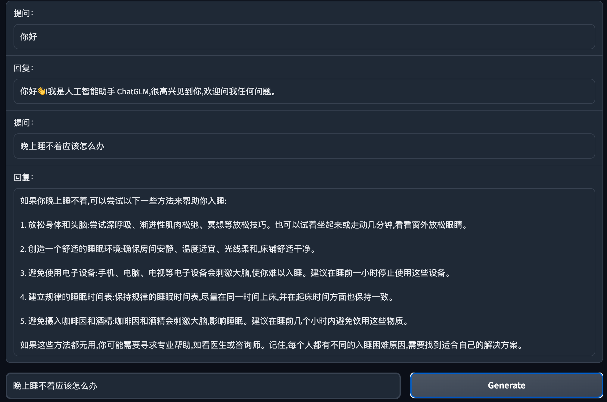

# ChatGLM-6B


<p align="center">
   🌐 <a href="https://chatglm.cn/blog" target="_blank">Blog</a> • 🤗 <a href="https://huggingface.co/THUDM/chatglm-6b" target="_blank">HF Repo</a> • 🐦 <a href="https://twitter.com/thukeg" target="_blank">Twitter</a> • 📃 <a href="https://arxiv.org/abs/2103.10360" target="_blank">[GLM@ACL 22]</a> <a href="https://github.com/THUDM/GLM" target="_blank">[GitHub]</a> • 📃 <a href="https://arxiv.org/abs/2210.02414" target="_blank">[GLM-130B@ICLR 23]</a> <a href="https://github.com/THUDM/GLM-130B" target="_blank">[GitHub]</a> <br>
</p>
<p align="center">
    👋 Join our <a href="https://join.slack.com/t/chatglm/shared_invite/zt-1t4a8evfn-vduo2hhNcYqBUnZ71IXiqQ" target="_blank">Slack</a> and <a href="resources/WECHAT.md" target="_blank">WeChat</a>
</p>

## Introduction

ChatGLM-6B is an open bilingual language model based on [General Language Model (GLM)](https://github.com/THUDM/GLM) framework, with 6.2 billion parameters. With the quantization technique, users can deploy locally on consumer-grade graphics cards (only 6GB of GPU memory is required at the INT4 quantization level).

ChatGLM-6B uses technology similar to ChatGPT, optimized for Chinese QA and dialogue. The model is trained for about 1T tokens of Chinese and English corpus, supplemented by supervised fine-tuning, feedback bootstrap, and reinforcement learning wit human feedback. With only about 6.2 billion parameters, the model is able to generate answers that are in line with human preference.

Try the [online demo](https://huggingface.co/spaces/ysharma/ChatGLM-6b_Gradio_Streaming) on Huggingface Spaces.

## Update
**[2023/03/31]** Added a parameter-efficient tuning implementation based on [P-Tuning-v2](https://github.com/THUDM/P-tuning-v2). The minimum INT4 quantization level only needs 7GB GPU memory is enough for model tuning. See [Parameter-efficient tuning method](ptuning/README.md) for details.

**[2023/03/23]** Add API deployment, thanks to [@LemonQu-GIT](https://github.com/LemonQu-GIT). Add embedding-quantized model [ChatGLM-6B-INT4-QE](https://huggingface.co/THUDM/chatglm-6b-int4-qe). Add support for GPU inference on Mac with Apple Silicon.

**[2023/03/19]** Add streaming output function `stream_chat`, already applied in web and CLI demo. Fix Chinese punctuations in output. Add quantized model [ChatGLM-6B-INT4](https://huggingface.co/THUDM/chatglm-6b-int4). 

## Projects
The following are some open source projects developed based on this repository:
* [ChatGLM-MNN](https://github.com/wangzhaode/ChatGLM-MNN): An [MNN](https://github.com/alibaba/MNN)-based implementation of ChatGLM-6B C++ inference, which supports automatic allocation of computing tasks to GPU and CPU according to the size of GPU memory
* [ChatGLM-Tuning](https://github.com/mymusise/ChatGLM-Tuning): Fine-tuning ChatGLM-6B based on LoRA

If you have other good projects, please refer to the above format to add to README and propose [PR](https://docs.github.com/en/pull-requests/collaborating-with-pull-requests/proposing-changes-to-your-work-with-pull-requests/creating-a-pull-request-from-a-fork).

## Getting Started

### Hardware Requirements

| **Quantization Level** | **GPU Memory** |
|------------------------|----------------|
| FP16（no quantization）  | 13 GB          |
| INT8                   | 10 GB          |
| INT4                   | 6 GB           |

### Environment Setup

Install the requirements with pip: `pip install -r requirements.txt`. `transformers` library version is recommended to be `4.27.1`, but theoretically any version no lower than `4.23.1` is acceptable.

In addition, if you need to run the quantified model on the CPU, you also need to install `gcc` and `openmp`. Most Linux distributions are installed by default. For Windows, you can check `openmp` when installing [TDM-GCC](https://jmeubank.github.io/tdm-gcc/). On Windows testing environment, the `gcc` version is `TDM-GCC 10.3.0`, and on Linux is `gcc 11.3.0`.

### Usage

Generate dialogue with the following code

```python
>>> from transformers import AutoTokenizer, AutoModel
>>> tokenizer = AutoTokenizer.from_pretrained("THUDM/chatglm-6b", trust_remote_code=True)
>>> model = AutoModel.from_pretrained("THUDM/chatglm-6b", trust_remote_code=True).half().cuda()
>>> model = model.eval()
>>> response, history = model.chat(tokenizer, "你好", history=[])
>>> print(response)
你好👋!我是人工智能助手 ChatGLM-6B,很高兴见到你,欢迎问我任何问题。
>>> response, history = model.chat(tokenizer, "晚上睡不着应该怎么办", history=history)
>>> print(response)
晚上睡不着可能会让你感到焦虑或不舒服,但以下是一些可以帮助你入睡的方法:

1. 制定规律的睡眠时间表:保持规律的睡眠时间表可以帮助你建立健康的睡眠习惯,使你更容易入睡。尽量在每天的相同时间上床,并在同一时间起床。
2. 创造一个舒适的睡眠环境:确保睡眠环境舒适,安静,黑暗且温度适宜。可以使用舒适的床上用品,并保持房间通风。
3. 放松身心:在睡前做些放松的活动,例如泡个热水澡,听些轻柔的音乐,阅读一些有趣的书籍等,有助于缓解紧张和焦虑,使你更容易入睡。
4. 避免饮用含有咖啡因的饮料:咖啡因是一种刺激性物质,会影响你的睡眠质量。尽量避免在睡前饮用含有咖啡因的饮料,例如咖啡,茶和可乐。
5. 避免在床上做与睡眠无关的事情:在床上做些与睡眠无关的事情,例如看电影,玩游戏或工作等,可能会干扰你的睡眠。
6. 尝试呼吸技巧:深呼吸是一种放松技巧,可以帮助你缓解紧张和焦虑,使你更容易入睡。试着慢慢吸气,保持几秒钟,然后缓慢呼气。

如果这些方法无法帮助你入睡,你可以考虑咨询医生或睡眠专家,寻求进一步的建议。
```

The full model implementation is on [HuggingFace Hub](https://huggingface.co/THUDM/chatglm-6b).

### Demo

We provide a Web demo based on [Gradio](https://gradio.app) and a command line demo in the repo. First clone our repo with:

```shell
git clone https://github.com/THUDM/ChatGLM-6B
cd ChatGLM-6B
```

#### Web Demo



Install Gradio `pip install gradio`，and run [web_demo.py](web_demo.py):

```shell
python web_demo.py
```

The program runs a web server and outputs the URL. Open the URL in the browser to use the web demo.

#### CLI Demo


Run [cli_demo.py](cli_demo.py) in the repo:

```shell
python cli_demo.py
```

The command runs an interactive program in the shell. Type your instruction in the shell and hit enter to generate the response. Type `clear` to clear the dialogue history and `stop` to terminate the program.

## API Deployment
First install the additional dependency `pip install fastapi uvicorn`. The run [api.py](api.py) in the repo.
```shell
python api.py
```
By default the api runs at the`8000`port of the local machine. You can call the API via 
```shell
curl -X POST "http://127.0.0.1:8000" \
     -H 'Content-Type: application/json' \
     -d '{"prompt": "你好", "history": []}'
```
The returned value is
```shell
{
  "response":"你好👋！我是人工智能助手 ChatGLM-6B，很高兴见到你，欢迎问我任何问题。",
  "history":[["你好","你好👋！我是人工智能助手 ChatGLM-6B，很高兴见到你，欢迎问我任何问题。"]],
  "status":200,
  "time":"2023-03-23 21:38:40"
}
```

## Deployment

### Quantization

By default, the model parameters are loaded with FP16 precision, which require about 13GB of GPU memory. It your GPU memory is limited, you can try to load the model parameters with quantization:

```python
# Change according to your hardware. Only support 4/8 bit quantization now.
model = AutoModel.from_pretrained("THUDM/chatglm-6b", trust_remote_code=True).half().quantize(4).cuda()
```

After 2 to 3 rounds of dialogue, the GPU memory usage is about 10GB under 8-bit quantization, and only 6GB under 4-bit quantization. As the number of dialogue rounds increases, the corresponding GPU memory consumption also increases. Due to the use of relative position encoding, ChatGLM-6B theoretically supports an infinitely long context-length, but the performance will gradually decline after the total length exceeds 2048 (training length).

Model quantization brings a certain performance decline. After testing, ChatGLM-6B can still perform natural and smooth generation under 4-bit quantization. using [GPT-Q](https://arxiv.org/abs/2210.17323) etc. The quantization scheme can further compress the quantization accuracy/improve the model performance under the same quantization accuracy. You are welcome to submit corresponding Pull Requests.

**[2023/03/19]** The quantization costs about 13GB of CPU memory to load the FP16 model. If your CPU memory is limited, you can directly load the quantized model, which costs only 5.2GB CPU memory: 
```python
model = AutoModel.from_pretrained("THUDM/chatglm-6b-int4", trust_remote_code=True).half().cuda()
```

### CPU Deployment

If your computer is not equipped with GPU, you can also conduct inference on CPU, but the inference speed is slow (and taking about 32GB of memory):

```python
model = AutoModel.from_pretrained("THUDM/chatglm-6b", trust_remote_code=True).float()
```

**[2023/03/19]** If your CPU memory is limited, you can directly load the quantized model:
```python
model = AutoModel.from_pretrained("THUDM/chatglm-6b-int4", trust_remote_code=True).float()
```

If your encounter the error `Could not find module 'nvcuda.dll'` or `RuntimeError: Unknown platform: darwin`(MacOS), please refer to this [Issue](https://github.com/THUDM/ChatGLM-6B/issues/6#issuecomment-1470060041). 

### GPU Inference on Mac
For Macs (and MacBooks) with Apple Silicon, it is possible to use the MPS backend to run ChatGLM-6B on the GPU. First, you need to refer to Apple's [official instructions](https://developer.apple.com/metal/pytorch) to install PyTorch-Nightly. Then clone the model repository locally (you need to [install Git LFS](https://docs.github.com/zh/repositories/working-with-files/managing-large-files/installing-git-large-file-storage)）
```shell
git lfs install
git clone https://huggingface.co/THUDM/chatglm-6b
```
Change the code to load the model from your local path, and use the mps backend:
```python
model = AutoModel.from_pretrained("your local path", trust_remote_code=True).half().to('mps')
```
Then you can use GPU-accelerated model inference on Mac.

## Parameter-efficient Tuning
Parameter-efficient tuning based on [P-tuning v2](https://github.com/THUDM/P-tuning-v2). See [ptuning/README.md](ptuning/README.md) for details on how to use it.


## ChatGLM-6B Examples

The following are some Chinese examples with `web_demo.py`. Welcome to explore more possibility with ChatGLM-6B.

<details><summary><b>Self Cognition</b></summary>


</details>

<details><summary><b>Outline</b></summary>


</details>

<details><summary><b>Ad</b></summary>


</details>

<details><summary><b>Email</b></summary>


</details>

<details><summary><b>Information Extraction</b></summary>


</details>

<details><summary><b>Role Play</b></summary>


</details>

<details><summary><b>Comparison</b></summary>


</details>

<details><summary><b>Travel Guide</b></summary>


</details>

## License

This repository is licensed under the [Apache-2.0 License](LICENSE). The use of ChatGLM-6B model weights is subject to the [Model License](MODEL_LICENSE)。

## Citation

If you find our work useful, please consider citing the following papers:

```
@inproceedings{
  zeng2023glm-130b,
  title={{GLM}-130B: An Open Bilingual Pre-trained Model},
  author={Aohan Zeng and Xiao Liu and Zhengxiao Du and Zihan Wang and Hanyu Lai and Ming Ding and Zhuoyi Yang and Yifan Xu and Wendi Zheng and Xiao Xia and Weng Lam Tam and Zixuan Ma and Yufei Xue and Jidong Zhai and Wenguang Chen and Zhiyuan Liu and Peng Zhang and Yuxiao Dong and Jie Tang},
  booktitle={The Eleventh International Conference on Learning Representations (ICLR)},
  year={2023},
  url={https://openreview.net/forum?id=-Aw0rrrPUF}
}
```

```
@inproceedings{du2022glm,
  title={GLM: General Language Model Pretraining with Autoregressive Blank Infilling},
  author={Du, Zhengxiao and Qian, Yujie and Liu, Xiao and Ding, Ming and Qiu, Jiezhong and Yang, Zhilin and Tang, Jie},
  booktitle={Proceedings of the 60th Annual Meeting of the Association for Computational Linguistics (Volume 1: Long Papers)},
  pages={320--335},
  year={2022}
}
```
