# ChatGLM-6B

<p align="center">
   🌐 <a href="https://chatglm.cn/blog" target="_blank">Blog</a> • 🤗 <a href="https://huggingface.co/THUDM/chatglm-6b" target="_blank">HF Repo</a> • 🐦 <a href="https://twitter.com/thukeg" target="_blank">Twitter</a> • 📃 <a href="https://arxiv.org/abs/2103.10360" target="_blank">[GLM@ACL 22]</a> <a href="https://github.com/THUDM/GLM" target="_blank">[GitHub]</a> • 📃 <a href="https://arxiv.org/abs/2210.02414" target="_blank">[GLM-130B@ICLR 23]</a> <a href="https://github.com/THUDM/GLM-130B" target="_blank">[GitHub]</a> <br>
</p>
<p align="center">
    👋 Join our <a href="https://join.slack.com/t/chatglm/shared_invite/zt-1y7pqoloy-9b1g6T6JjA8J0KxvUjbwJw" target="_blank">Slack</a> and <a href="resources/WECHAT.md" target="_blank">WeChat</a>
</p>

## Introduction

ChatGLM-6B is an open bilingual language model based on [General Language Model (GLM)](https://github.com/THUDM/GLM) framework, with 6.2 billion parameters. With the quantization technique, users can deploy locally on consumer-grade graphics cards (only 6GB of GPU memory is required at the INT4 quantization level).

ChatGLM-6B uses technology similar to ChatGPT, optimized for Chinese QA and dialogue. The model is trained for about 1T tokens of Chinese and English corpus, supplemented by supervised fine-tuning, feedback bootstrap, and reinforcement learning wit human feedback. With only about 6.2 billion parameters, the model is able to generate answers that are in line with human preference.

In order to facilitate downstream developers to customize the model for their own application scenarios, we also implements an parameter-efficient tuning method based on [P-Tuning v2](https://github.com/THUDM/P-tuning-v2)[(Guidelines)](ptuning/README_en.md). Tuning requires at least 7GB of GPU memory at INT4 quantization level.

Try the [online demo](https://huggingface.co/spaces/ysharma/ChatGLM-6b_Gradio_Streaming) on Huggingface Spaces.

## Update
**[2023/06/25]** Release [ChatGLM2-6B](https://github.com/THUDM/ChatGLM2-6B), the second-generation version of ChatGLM-6B. It retains the smooth conversation flow and low deployment threshold of the first-generation model, while introducing the following new features:

1. **Stronger Performance**: Based on the development experience of the first-generation ChatGLM model, we have fully upgraded the base model of ChatGLM2-6B. ChatGLM2-6B uses the hybrid objective function of [GLM](https://github.com/THUDM/GLM), and has undergone pre-training with 1.4T bilingual tokens and human preference alignment training. The [evaluation results](README.md#evaluation-results) show that, compared to the first-generation model, ChatGLM2-6B has achieved substantial improvements in performance on datasets like MMLU (+23%), CEval (+33%), GSM8K (+571%), BBH (+60%), showing strong competitiveness among models of the same size.
2. **Longer Context**: Based on [FlashAttention](https://github.com/HazyResearch/flash-attention) technique, we have extended the context length of the base model from 2K in ChatGLM-6B to 32K, and trained with a context length of 8K during the dialogue alignment, allowing for more rounds of dialogue. However, the current version of ChatGLM2-6B has limited understanding of single-round ultra-long documents, which we will focus on optimizing in future iterations.
3. **More Efficient Inference**: Based on [Multi-Query Attention](http://arxiv.org/abs/1911.02150) technique, ChatGLM2-6B has more efficient inference speed and lower GPU memory usage: under the official  implementation, the inference speed has increased by 42% compared to the first generation; under INT4 quantization, the dialogue length supported by 6G GPU memory has increased from 1K to 8K.

Fore more information, please refer to [ChatGLM2-6B](https://github.com/THUDM/ChatGLM2-6B).

**[2023/05/17]** Release [VisualGLM-6B](https://github.com/THUDM/VisualGLM-6B), a multimodal conversational language model supporting image understanding.

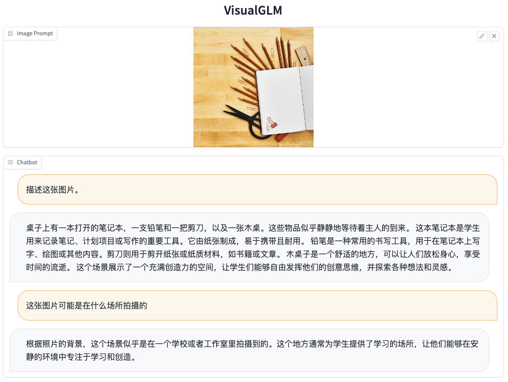

You can run the command line and web demo through [cli_demo_vision.py](cli_demo_vision.py) and [web_demo_vision.py](web_demo_vision.py) in the repository. Note that VisualGLM-6B requires additional installation of [SwissArmyTransformer](https://github.com/THUDM/SwissArmyTransformer/) and torchvision. For more information, please refer to  [VisualGLM-6B](https://github.com/THUDM/VisualGLM-6B).

**[2023/05/15]** Update the checkpoint of v1.1 version, add English instruction data for training to balance the proportion of Chinese and English data, which solves the phenomenon of Chinese words mixed in English answers .

<details><summary><b>The following is a comparison of English questions before and after the update</b></summary>

* Question: Describe a time when you had to make a difficult decision.
  - v1.0:
  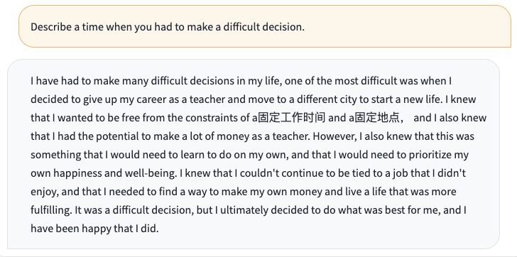
  - v1.1:
  
* Question: Describe the function of a computer motherboard
  - v1.0:
  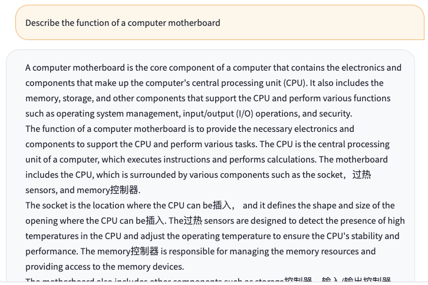
  - v1.1:
  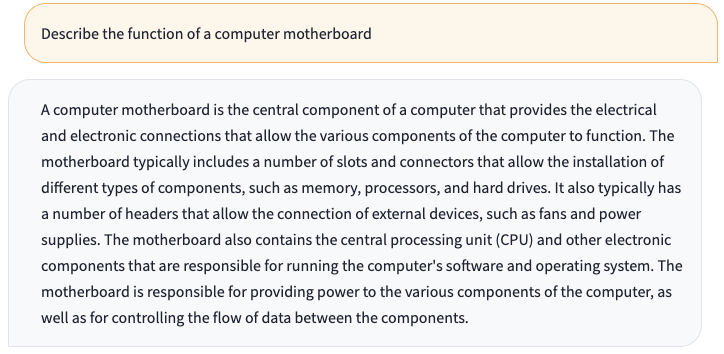
* Question: Develop a plan to reduce electricity usage in a home.
  - v1.0:
  
  - v1.1:
  
* Question：未来的NFT，可能真实定义一种现实的资产，它会是一处房产，一辆汽车，一片土地等等，这样的数字凭证可能比真实的东西更有价值，你可以随时交易和使用，在虚拟和现实中无缝的让拥有的资产继续创造价值，未来会是万物归我所用，但不归我所有的时代。翻译成专业的英语
  - v1.0:
  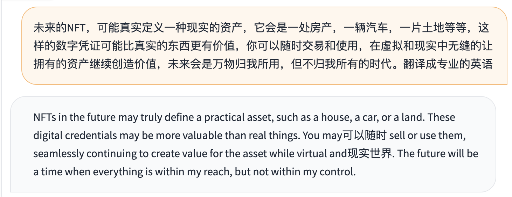
  - v1.1:
  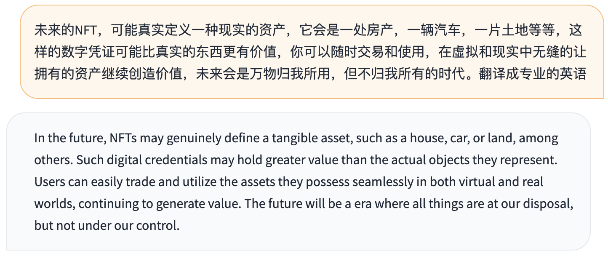
</details>

For more update info, please refer to [UPDATE.md](UPDATE.md).

## Projects
Open source projects that accelerate ChatGLM:
* [lyraChatGLM](https://huggingface.co/TMElyralab/lyraChatGLM): Inference acceleration for ChatGLM-6B, up to 9000+ tokens/s inference speed.
* [ChatGLM-MNN](https://github.com/wangzhaode/ChatGLM-MNN): An MNN-based implementation of ChatGLM-6B C++ inference, which supports automatic allocation of computing tasks to GPU and CPU according to the size of GPU memory
* [JittorLLMs](https://github.com/Jittor/JittorLLMs): Running ChatGLM-6B in FP16 with a minimum of 3G GPU memory or no GPU at all, with Linux, windows, and Mac support
* [InferLLM](https://github.com/MegEngine/InferLLM): Lightweight C++ inference, which can realize real-time chat on local x86 and Arm processors, and can also run in real time on mobile phones. It only requires 4G of running memory.

Open source projects using ChatGLM-6B:
* [langchain-ChatGLM](https://github.com/imClumsyPanda/langchain-ChatGLM): ChatGLM application based on langchain, realizing Q&A based on extensible knowledge base
* [Wenda](https://github.com/l15y/wenda): Large-scale language model call platform, based on ChatGLM-6B to achieve ChatPDF-like functions
* [chatgpt_academic](https://github.com/binary-husky/chatgpt_academic): An academic writing and programming toolbox that supports ChatGLM-6B. It has the characteristics of modularization and multi-thread calling LLM, and can call multiple LLMs in parallel.
* [glm-bot](https://github.com/initialencounter/glm-bot): Connect ChatGLM to Koishi to call ChatGLM on major chat platforms

Example projects supporting online training of ChatGLM-6B and related applications:
* [ChatGLM-6B deployment and fine-tuning tutorial](https://www.heywhale.com/mw/project/6436d82948f7da1fee2be59e)
* [ChatGLM-6B combined with langchain to implement local knowledge base QA Bot](https://www.heywhale.com/mw/project/643977aa446c45f4592a1e59)

Third-party evaluation:
* [Measuring Massive Multitask Chinese Understanding](https://arxiv.org/abs/2304.12986)

For more open source projects, see [PROJECT.md](PROJECT.md).

## Getting Started

### Hardware Requirements

| **Quantization Level** | **GPU Memory** |
|------------------------|----------------|
| FP16（no quantization）  | 13 GB          |
| INT8                   | 10 GB          |
| INT4                   | 6 GB           |

### Environment Setup

Install the requirements with pip: `pip install -r requirements.txt`. `transformers` library version is recommended to be `4.27.1`, but theoretically any version no lower than `4.23.1` is acceptable.

In addition, if you need to run the quantified model on the CPU, you also need to install `gcc` and `openmp`. Most Linux distributions are installed by default. For Windows, you can check `openmp` when installing [TDM-GCC](https://jmeubank.github.io/tdm-gcc/). On Windows testing environment, the `gcc` version is `TDM-GCC 10.3.0`, and on Linux is `gcc 11.3.0`.

### Usage

Generate dialogue with the following code

```python
>>> from transformers import AutoTokenizer, AutoModel
>>> tokenizer = AutoTokenizer.from_pretrained("THUDM/chatglm-6b", trust_remote_code=True)
>>> model = AutoModel.from_pretrained("THUDM/chatglm-6b", trust_remote_code=True).half().cuda()
>>> model = model.eval()
>>> response, history = model.chat(tokenizer, "你好", history=[])
>>> print(response)
你好👋!我是人工智能助手 ChatGLM-6B,很高兴见到你,欢迎问我任何问题。
>>> response, history = model.chat(tokenizer, "晚上睡不着应该怎么办", history=history)
>>> print(response)
晚上睡不着可能会让你感到焦虑或不舒服,但以下是一些可以帮助你入睡的方法:

1. 制定规律的睡眠时间表:保持规律的睡眠时间表可以帮助你建立健康的睡眠习惯,使你更容易入睡。尽量在每天的相同时间上床,并在同一时间起床。
2. 创造一个舒适的睡眠环境:确保睡眠环境舒适,安静,黑暗且温度适宜。可以使用舒适的床上用品,并保持房间通风。
3. 放松身心:在睡前做些放松的活动,例如泡个热水澡,听些轻柔的音乐,阅读一些有趣的书籍等,有助于缓解紧张和焦虑,使你更容易入睡。
4. 避免饮用含有咖啡因的饮料:咖啡因是一种刺激性物质,会影响你的睡眠质量。尽量避免在睡前饮用含有咖啡因的饮料,例如咖啡,茶和可乐。
5. 避免在床上做与睡眠无关的事情:在床上做些与睡眠无关的事情,例如看电影,玩游戏或工作等,可能会干扰你的睡眠。
6. 尝试呼吸技巧:深呼吸是一种放松技巧,可以帮助你缓解紧张和焦虑,使你更容易入睡。试着慢慢吸气,保持几秒钟,然后缓慢呼气。

如果这些方法无法帮助你入睡,你可以考虑咨询医生或睡眠专家,寻求进一步的建议。
```
The implementation of the model is still in development. If you want to fix the used model implementation to ensure compatibility, you can add the `revision="v1.1.0"` parameter in the `from_pretrained` call. `v1.1.0` is the latest version number. For a complete list of versions, see [Change Log](https://huggingface.co/THUDM/chatglm-6b#change-log).

### Load the model locally
The above code will automatically download the model implementation and checkpoints by [transformers](https://github.com/huggingface/transformers). The full model implementation can be found at [Hugging Face Hub](https://huggingface.co/THUDM/chatglm-6b). If your network environment is poor, downloading model parameters may take a long time or even fail. At this point, you can download the model to the local first, and then load it from the local.

To download models from Hugging Face Hub, you need to [install Git LFS](https://docs.github.com/zh/repositories/working-with-files/managing-large-files/installing-git-large-file-storage) , then run
```Shell
git clone https://huggingface.co/THUDM/chatglm-6b
```

After downloading the model locally, replace `THUDM/chatglm-6b` in the above code with the path of your local `chatglm-6b` folder to load the model locally.

**Optional**: The implementation of the model is still in development. If you want to fix the used model implementation to ensure compatibility, you can execute
```Shell
git checkout v1.1.0
```

## Demo & API

We provide a Web demo based on [Gradio](https://gradio.app) and a command line demo in the repo. First clone our repo with:

```shell
git clone https://github.com/THUDM/ChatGLM-6B
cd ChatGLM-6B
```

### Web Demo

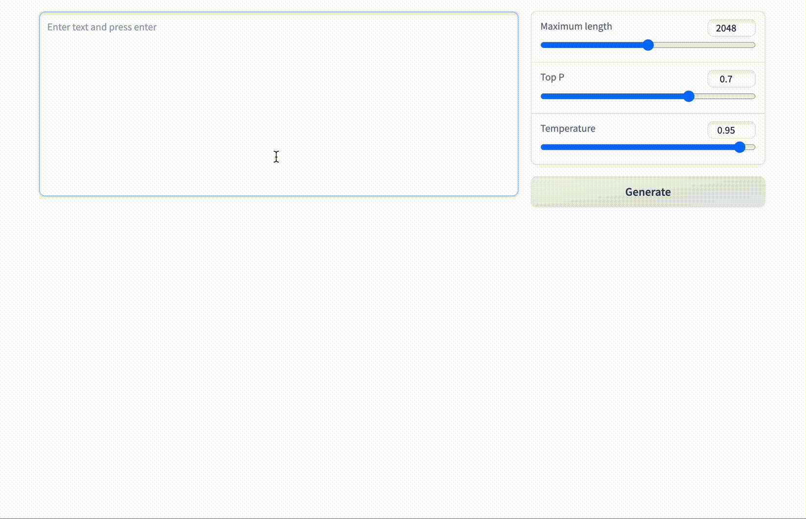

Install Gradio `pip install gradio`，and run [web_demo.py](web_demo.py):

```shell
python web_demo.py
```

The program runs a web server and outputs the URL. Open the URL in the browser to use the web demo.

Thanks to [@AdamBear](https://github.com/AdamBear) for implementing a web demo based on Streamlit, see [#117](https://github.com/THUDM/ChatGLM-6B/pull/117 ).

#### CLI Demo

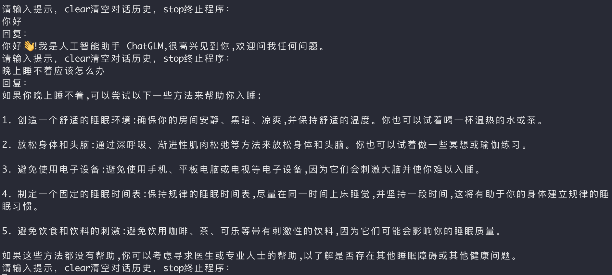

Run [cli_demo.py](cli_demo.py) in the repo:

```shell
python cli_demo.py
```

The command runs an interactive program in the shell. Type your instruction in the shell and hit enter to generate the response. Type `clear` to clear the dialogue history and `stop` to terminate the program.

## API Deployment
First install the additional dependency `pip install fastapi uvicorn`. The run [api.py](api.py) in the repo.
```shell
python api.py
```
By default the api runs at the`8000`port of the local machine. You can call the API via 
```shell
curl -X POST "http://127.0.0.1:8000" \
     -H 'Content-Type: application/json' \
     -d '{"prompt": "你好", "history": []}'
```
The returned value is
```shell
{
  "response":"你好👋！我是人工智能助手 ChatGLM-6B，很高兴见到你，欢迎问我任何问题。",
  "history":[["你好","你好👋！我是人工智能助手 ChatGLM-6B，很高兴见到你，欢迎问我任何问题。"]],
  "status":200,
  "time":"2023-03-23 21:38:40"
}
```

## Stream API Deployment

First install the additional dependency `pip install flask` Then run stream_api.py in the repo

```shell
python stream_api.py
```

By default the api runs at the `8000` port of the local machine. A total of 2 interfaces, need to be used together, default use application/json as Content-Type, service description is as follows:

The streaming API uses Flask as a carrier to set the waiting queue and processing queue using the thread pool principle, and developers can determine the queue length according to the actual performance of the hardware.

#### 1、Interface 1：/chat 

To open a dialogue (referring to a question and an answer), after calling this API, you should continuously(maybe 1 second interval) call Interface 2 and use the `request_id` to obtain the conversation response content in streaming.

- Example request data is as follows, where `request_id` is specified by the caller and is used to determine the conversation entity

```json
{
    "history": [["你是谁？","我是智能机器人"]],
    "query": "你好",
    "request_id": "73"  
}

```

- The sample response data is as follows: it represents a normal response, and the service side starts processing or queues

```json
{
    "code": 0,
    "msg": "start process",
}
```

#### 2、Interface 2：/get_response

Use `request_id` to obtain the response content of the dialogue, and this API should be called regularly until the `is_finished = True` returned by the interface, indicating that the conversation has been inferred.

- The sample request data is as follows, where `request_id` specified in Interface 1

```
{
    "request_id": "73"
}
```

- Example response data 1 is as follows: (Indicates that the request is still waiting in the queue and has not yet started being inferred)

```
{
    "code": 0,
    "msg": "success",
    "response": {
        "is_finished": false,
        "is_handled": false,
        "response": "",
        "timestamp": 1679813631.926929
    }
}
```

- The sample response data 2 is as follows: (It means that the request has entered the inference queue and has not yet been inferenced)

```
{
    "code": 0,
    "msg": "success",
    "response": {
        "is_finished": false,
        "is_handled": true,
        "response": "我是智能机器人，请问",
        "timestamp": 1679813631.926929
    }
}
```

## Deployment

### Quantization

By default, the model parameters are loaded with FP16 precision, which require about 13GB of GPU memory. It your GPU memory is limited, you can try to load the model parameters with quantization:

```python
# Change according to your hardware. Only support 4/8 bit quantization now.
model = AutoModel.from_pretrained("THUDM/chatglm-6b", trust_remote_code=True).half().quantize(8).cuda()
```

After 2 to 3 rounds of dialogue, the GPU memory usage is about 10GB under 8-bit quantization, and only 6GB under 4-bit quantization. As the number of dialogue rounds increases, the corresponding GPU memory consumption also increases. Due to the use of relative position encoding, ChatGLM-6B theoretically supports an infinitely long context-length, but the performance will gradually decline after the total length exceeds 2048 (training length).

Model quantization brings a certain performance decline. After testing, ChatGLM-6B can still perform natural and smooth generation under 4-bit quantization. using [GPT-Q](https://arxiv.org/abs/2210.17323) etc. The quantization scheme can further compress the quantization accuracy/improve the model performance under the same quantization accuracy. You are welcome to submit corresponding Pull Requests.

The quantization costs about 13GB of CPU memory to load the FP16 model. If your CPU memory is limited, you can directly load the quantized model, which costs only 5.2GB CPU memory: 
```python
# For INT8-quantized model, change "chatglm-6b-int4" to "chatglm-6b-int8"
model = AutoModel.from_pretrained("THUDM/chatglm-6b-int4", trust_remote_code=True).half().cuda()
```

### CPU Deployment

If your computer is not equipped with GPU, you can also conduct inference on CPU, but the inference speed is slow (and taking about 32GB of memory):

```python
model = AutoModel.from_pretrained("THUDM/chatglm-6b", trust_remote_code=True).float()
```

If your CPU memory is limited, you can directly load the quantized model:
```python
# For INT8-quantized model, change "chatglm-6b-int4" to "chatglm-6b-int8"
model = AutoModel.from_pretrained("THUDM/chatglm-6b-int4", trust_remote_code=True).float()
```

If your encounter the error `Could not find module 'nvcuda.dll'` or `RuntimeError: Unknown platform: darwin`(MacOS), please [load the model locally](README_en.md#load-the-model-locally). 

### Inference on Mac
For Macs (and MacBooks) with Apple Silicon, it is possible to use the MPS backend to run ChatGLM-6B on the GPU. First, you need to refer to Apple's [official instructions](https://developer.apple.com/metal/pytorch) to install PyTorch-Nightly. (The correct version number should be 2.1.0.dev2023xxxx, not 2.0.0).

Currently you must [load the model locally](README_en.md#load-the-model-locally) on MacOS. Change the code to load the model from your local path, and use the mps backend:
```python
model = AutoModel.from_pretrained("your local path", trust_remote_code=True).half().to('mps')
```

Loading a FP16 ChatGLM-6B model requires about 13GB of memory. Machines with less memory (such as a MacBook Pro with 16GB of memory) will use the virtual memory on the hard disk when there is insufficient free memory, resulting in a serious slowdown in inference speed. At this time, a quantized model such as chatglm-6b-int4 can be used. Because the quantized kernel on the GPU is written in CUDA, it cannot be used on MacOS, and can only be inferred using the CPU:

```python
# For INT8-quantized model, change "chatglm-6b-int4" to "chatglm-6b-int8"
model = AutoModel.from_pretrained("THUDM/chatglm-6b-int4", trust_remote_code=True).float()
```

### Multi-GPU Deployment
If you have multiple GPUs, but the memory size of each GPU is not sufficient to accommodate the entire model, you can split the model across multiple GPUs. 

First, install accelerate: `pip install accelerate`, and then load the model using the following method:
```python
from utils import load_model_on_gpus
model = load_model_on_gpus("THUDM/chatglm-6b", num_gpus=2)
```

This will deploy the model onto two GPUs for inference. You can change `num_gpus` to the number of GPUs you want to use. By default, the model is split evenly, but you can also specify the `device_map` parameter to customize the splitting.

## Parameter-efficient Tuning
Parameter-efficient tuning based on [P-tuning v2](https://github.com/THUDM/P-tuning-v2). See [ptuning/README.md](ptuning/README.md) for details on how to use it.

## ChatGLM-6B Examples

The following are some Chinese examples with `web_demo.py`. Welcome to explore more possibility with ChatGLM-6B.

<details><summary><b>Self Cognition</b></summary>

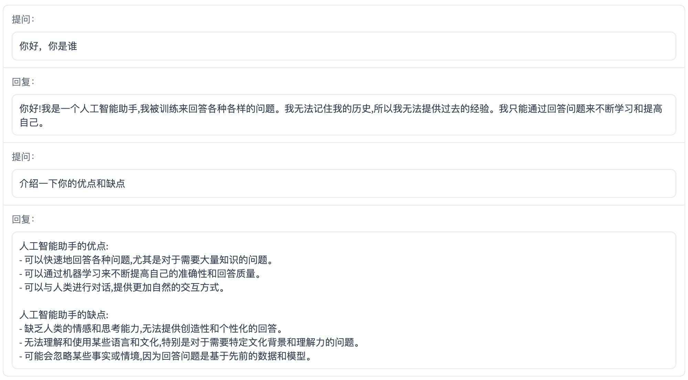

</details>

<details><summary><b>Outline</b></summary>

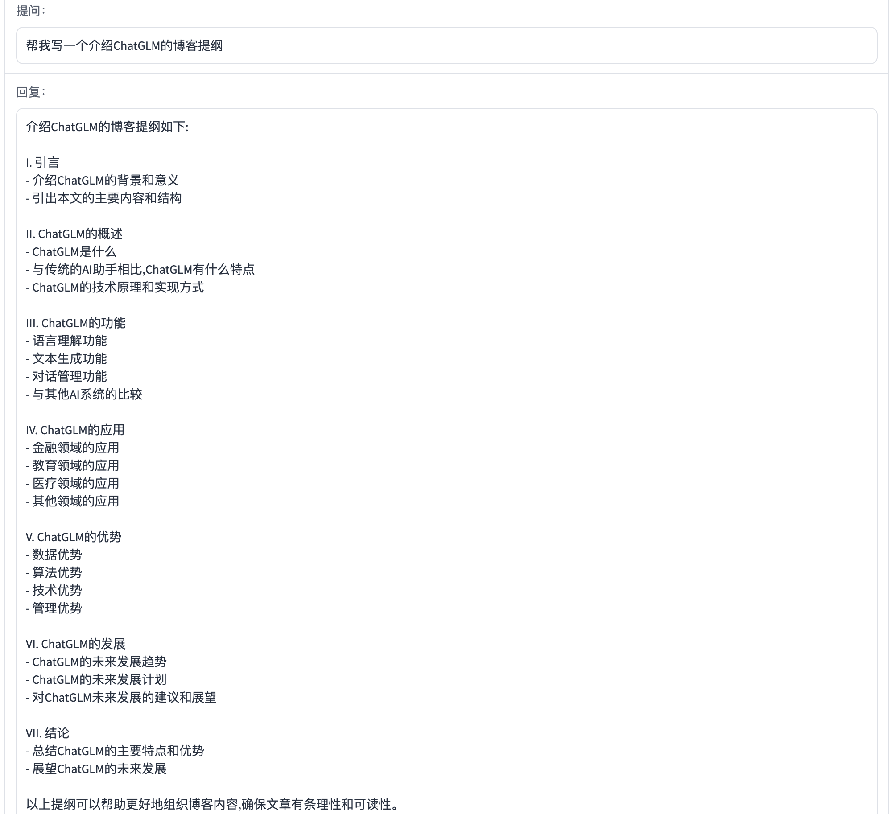

</details>

<details><summary><b>Ad</b></summary>

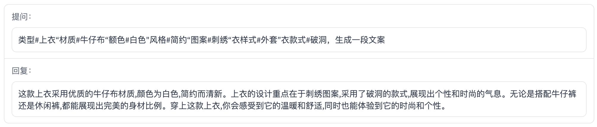

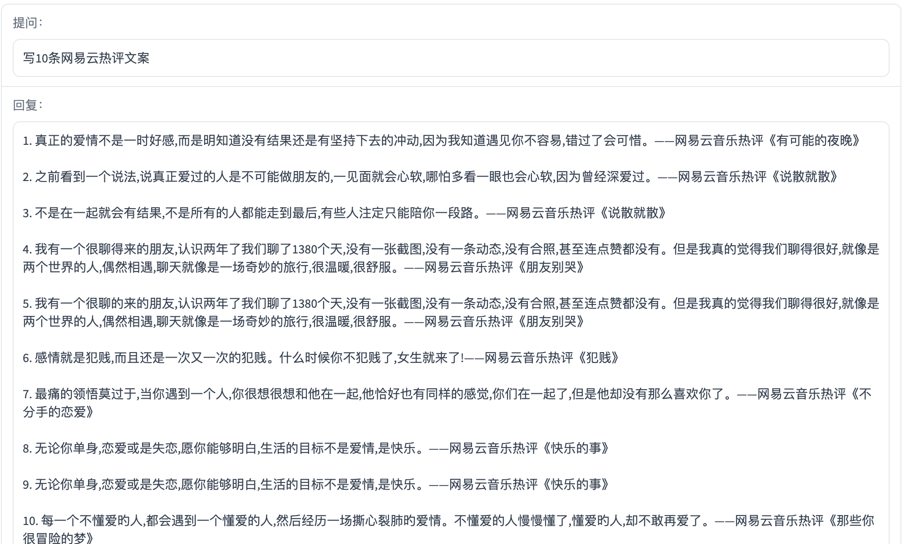

</details>

<details><summary><b>Email</b></summary>

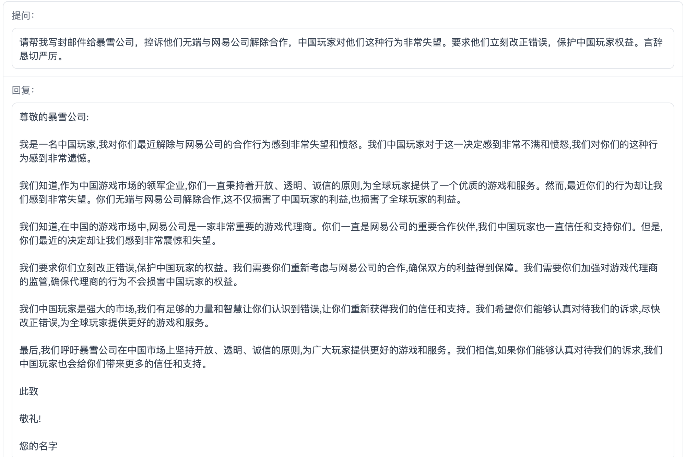

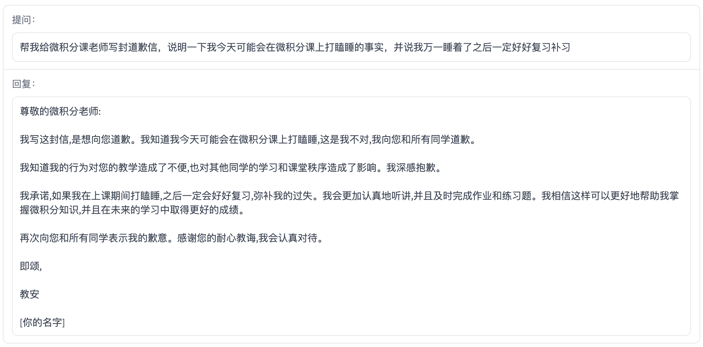

</details>

<details><summary><b>Information Extraction</b></summary>

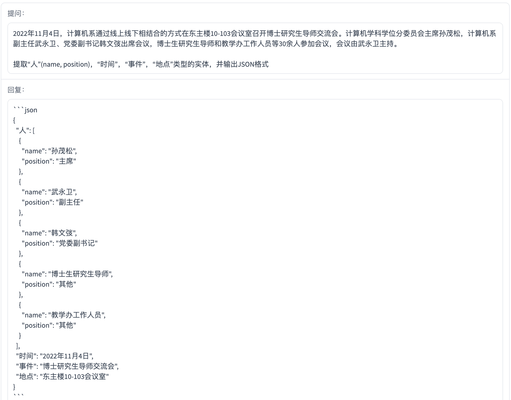

</details>

<details><summary><b>Role Play</b></summary>

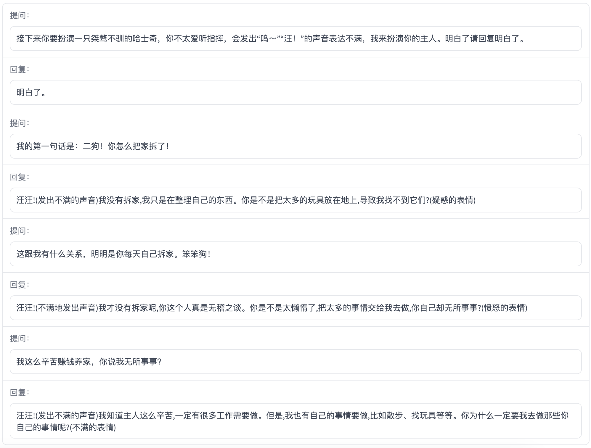

</details>

<details><summary><b>Comparison</b></summary>

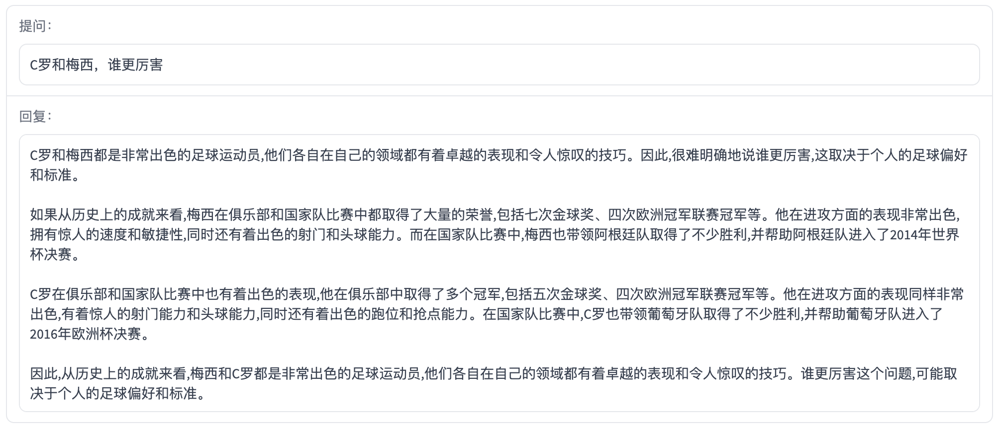

</details>

<details><summary><b>Travel Guide</b></summary>

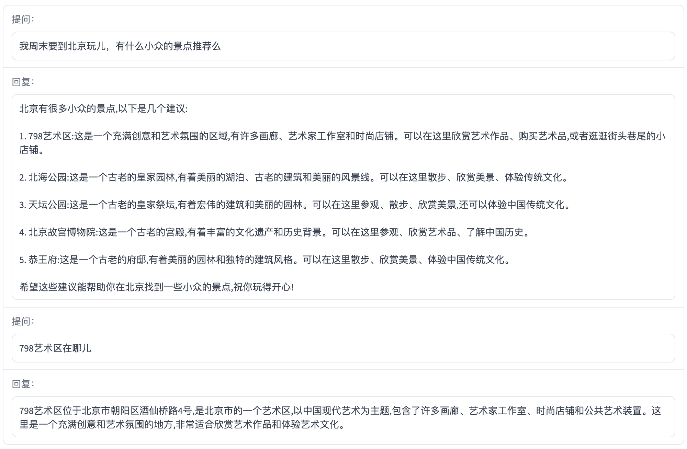

</details>

## License

This repository is licensed under the [Apache-2.0 License](LICENSE). The use of ChatGLM-6B model weights is subject to the [Model License](MODEL_LICENSE)。

## Citation

If you find our work useful, please consider citing the following papers:

```
@inproceedings{
  zeng2023glm-130b,
  title={{GLM}-130B: An Open Bilingual Pre-trained Model},
  author={Aohan Zeng and Xiao Liu and Zhengxiao Du and Zihan Wang and Hanyu Lai and Ming Ding and Zhuoyi Yang and Yifan Xu and Wendi Zheng and Xiao Xia and Weng Lam Tam and Zixuan Ma and Yufei Xue and Jidong Zhai and Wenguang Chen and Zhiyuan Liu and Peng Zhang and Yuxiao Dong and Jie Tang},
  booktitle={The Eleventh International Conference on Learning Representations (ICLR)},
  year={2023},
  url={https://openreview.net/forum?id=-Aw0rrrPUF}
}
```

```
@inproceedings{du2022glm,
  title={GLM: General Language Model Pretraining with Autoregressive Blank Infilling},
  author={Du, Zhengxiao and Qian, Yujie and Liu, Xiao and Ding, Ming and Qiu, Jiezhong and Yang, Zhilin and Tang, Jie},
  booktitle={Proceedings of the 60th Annual Meeting of the Association for Computational Linguistics (Volume 1: Long Papers)},
  pages={320--335},
  year={2022}
}
```
