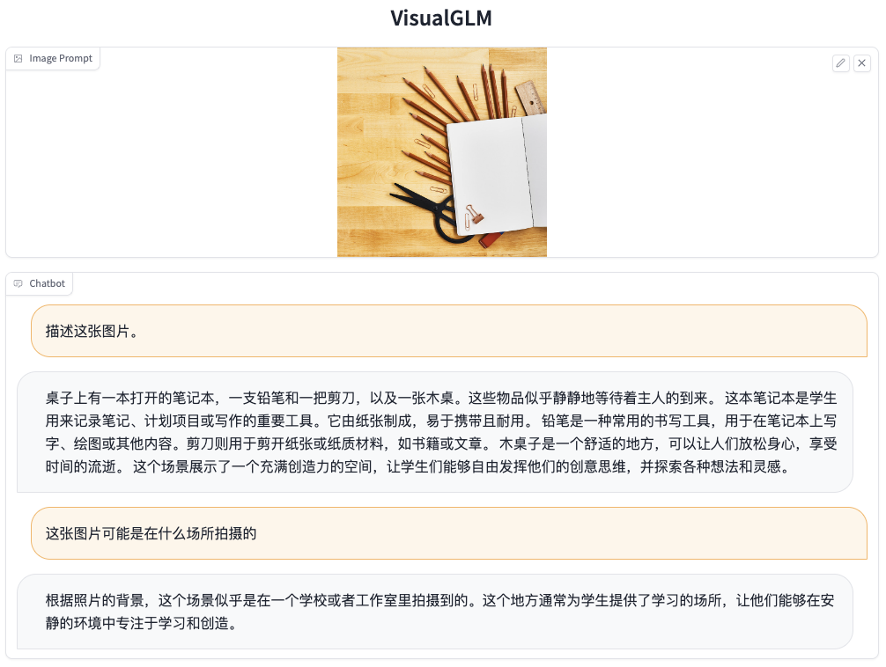
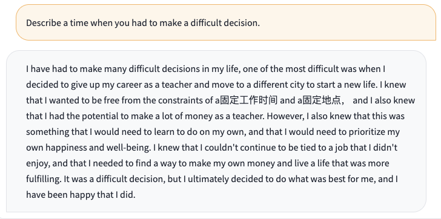
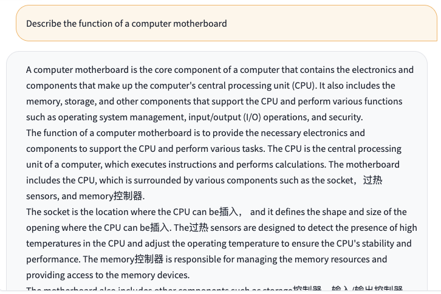
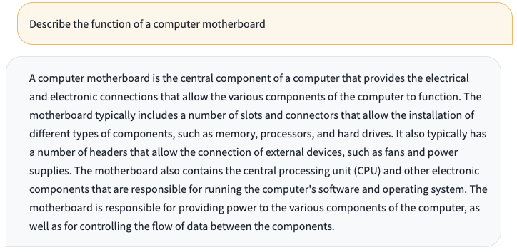
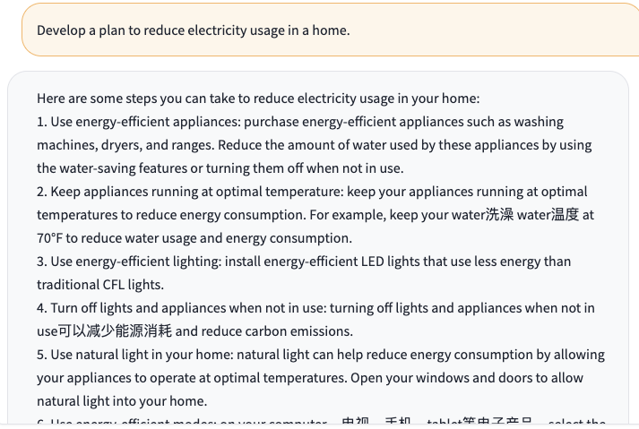
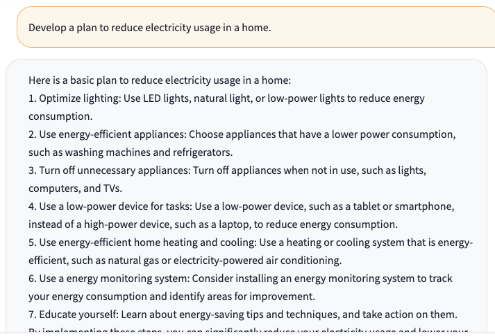
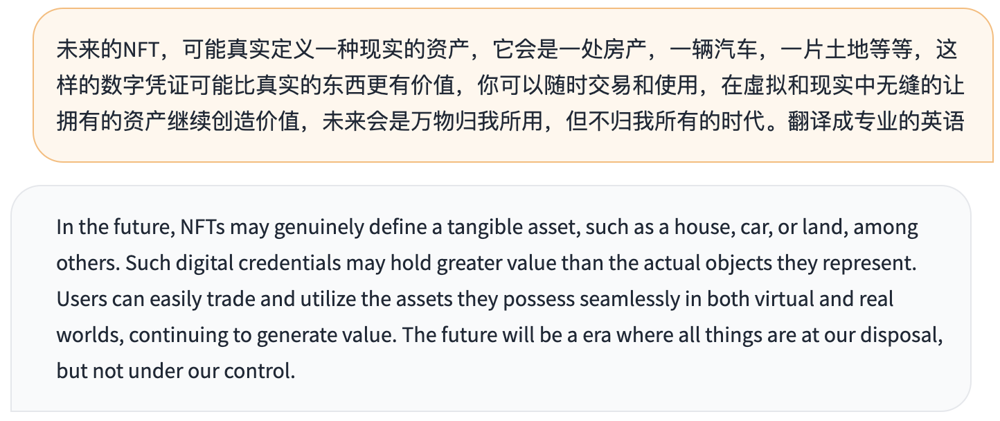

## 更新信息
**[2023/05/17]** 发布 [VisualGLM-6B](https://github.com/THUDM/VisualGLM-6B)，一个支持图像理解的多模态对话语言模型。

可以通过本仓库中的 [cli_demo_vision.py](cli_demo_vision.py) 和 [web_demo_vision.py](web_demo_vision.py) 来运行命令行和网页 Demo。注意 VisualGLM-6B 需要额外安装 [SwissArmyTransformer](https://github.com/THUDM/SwissArmyTransformer/) 和 torchvision。更多信息参见 [VisualGLM-6B](https://github.com/THUDM/VisualGLM-6B)。

**[2023/05/15]** 更新 v1.1 版本 checkpoint，训练数据增加英文数据以平衡中英文数据比例，解决英文回答中夹杂中文词语的现象。

<b>以下是更新前后的英文问题对比：</b>

* 问题：Describe a time when you had to make a difficult decision.
  - v1.0:
  
  - v1.1:
  
* 问题：Describe the function of a computer motherboard
  - v1.0:
  
  - v1.1: 
  
* 问题：Develop a plan to reduce electricity usage in a home.
  - v1.0:
  
  - v1.1:
  
* 问题：未来的NFT，可能真实定义一种现实的资产，它会是一处房产，一辆汽车，一片土地等等，这样的数字凭证可能比真实的东西更有价值，你可以随时交易和使用，在虚拟和现实中无缝的让拥有的资产继续创造价值，未来会是万物归我所用，但不归我所有的时代。翻译成专业的英语
  - v1.0:
  
  - v1.1:
  

**[2023/04/16]** 增加 INT8 量化后的模型 [ChatGLM-6B-INT8](https://huggingface.co/THUDM/chatglm-6b-int8)。增加多卡部署（感谢 [@Cherrysaber](https://github.com/Cherrysaber)）。

**[2023/04/06]** 优化web demo的界面（感谢 [@tuteng0915](https://github.com/tuteng0915)）。移除embedding中的image token以减小显存占用（需要更新模型文件`pytorch_model-00001-of-00008.bin`和`pytorch_model-00008-of-00008.bin`，感谢 [@silverriver](https://github.com/silverriver) 提出的想法）。去掉了对 `icetk` 的依赖（需要更新模型文件`ice_text.model`）。

**[2023/03/31]** 增加基于 [P-Tuning-v2](https://github.com/THUDM/P-tuning-v2) 的高效参数微调实现，INT4 量化级别下最低只需 7GB 显存即可进行模型微调。详见[高效参数微调方法](ptuning/README.md)。

**[2023/03/23]** 增加 API 部署（感谢 [@LemonQu-GIT](https://github.com/LemonQu-GIT)）。~~增加 Embedding 量化模型 [ChatGLM-6B-INT4-QE](https://huggingface.co/THUDM/chatglm-6b-int4-qe)~~ (已停止维护)。增加配备 Apple Silicon 芯片的 Mac 上 GPU 加速的支持。

**[2023/03/19]** 增加流式输出接口 `stream_chat`，已更新到网页版和命令行 Demo。修复输出中的中文标点。增加 INT4 量化后的模型 [ChatGLM-6B-INT4](https://huggingface.co/THUDM/chatglm-6b-int4)

## Update
**[2023/05/17]** Release [VisualGLM-6B](https://github.com/THUDM/VisualGLM-6B), a multimodal conversational language model supporting image understanding.

You can run the command line and web demo through [cli_demo_vision.py](cli_demo_vision.py) and [web_demo_vision.py](web_demo_vision.py) in the repository. Note that VisualGLM-6B requires additional installation of [SwissArmyTransformer](https://github.com/THUDM/SwissArmyTransformer/) and torchvision. For more information, please refer to  [VisualGLM-6B](https://github.com/THUDM/VisualGLM-6B).

**[2023/05/15]** Update the checkpoint of v1.1 version, add English instruction data for training to balance the proportion of Chinese and English data, which solves the phenomenon of Chinese words mixed in English answers .

<b>The following is a comparison of English questions before and after the update</b>

* Question: Describe a time when you had to make a difficult decision.
  - v1.0:
  
  - v1.1:
  
* Question: Describe the function of a computer motherboard
  - v1.0:
  
  - v1.1:
  
* Question: Develop a plan to reduce electricity usage in a home.
  - v1.0:
  
  - v1.1:
  
* Question：未来的NFT，可能真实定义一种现实的资产，它会是一处房产，一辆汽车，一片土地等等，这样的数字凭证可能比真实的东西更有价值，你可以随时交易和使用，在虚拟和现实中无缝的让拥有的资产继续创造价值，未来会是万物归我所用，但不归我所有的时代。翻译成专业的英语
  - v1.0:
  
  - v1.1:
  

**[2023/04/16]** Added INT8 quantized model [ChatGLM-6B-INT8](https://huggingface.co/THUDM/chatglm-6b-int8). Added multi-GPU deployment (thanks to [@Cherrysaber](https://github.com/Cherrysaber)).

**[2023/04/06]** Improve the web demo interface (thanks to [@tuteng0915](https://github.com/tuteng0915)). Remove the image tokens in the embedding layer to reduce the memory usage (need to update the model files `pytorch_model-00001-of-00008.bin` and `pytorch_model-00008-of-00008.bin`, thanks to [@silverriver](https:/ /github.com/silverriver) for proposing the idea). Removed dependency on `icetk` (need to update model file `ice_text.model`).

**[2023/03/31]** Added a parameter-efficient tuning implementation based on [P-Tuning-v2](https://github.com/THUDM/P-tuning-v2). The minimum INT4 quantization level only needs 7GB GPU memory is enough for model tuning. See [Parameter-efficient tuning method](ptuning/README.md) for details.

**[2023/03/23]** Add API deployment, thanks to [@LemonQu-GIT](https://github.com/LemonQu-GIT). Add embedding-quantized model [ChatGLM-6B-INT4-QE](https://huggingface.co/THUDM/chatglm-6b-int4-qe). Add support for GPU inference on Mac with Apple Silicon.

**[2023/03/19]** Add streaming output function `stream_chat`, already applied in web and CLI demo. Fix Chinese punctuations in output. Add quantized model [ChatGLM-6B-INT4](https://huggingface.co/THUDM/chatglm-6b-int4). 